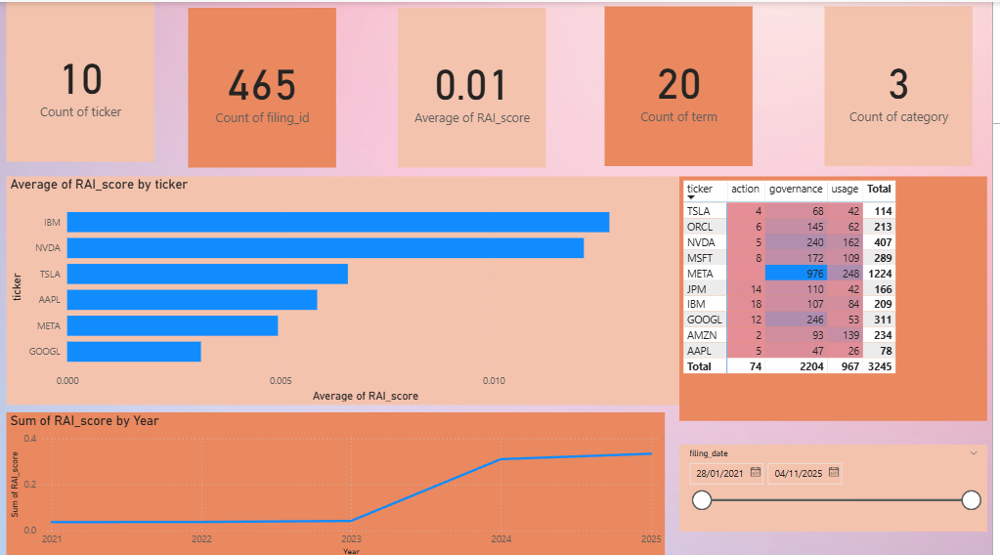
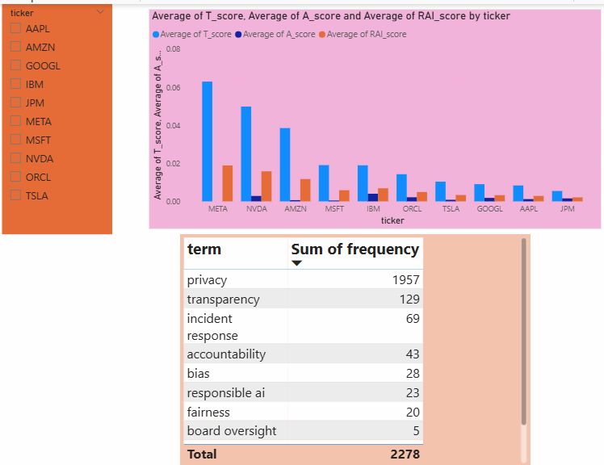
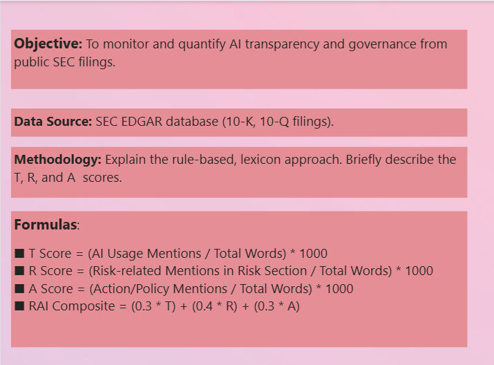

# AI Disclosure & Transparency Monitor (ADTM)

**Project Status:** Completed

ADTM is a data analytics project that automatically downloads, processes, and analyzes official corporate filings from the SEC to quantify and monitor how publicly traded companies are disclosing their use of, and governance over, Artificial Intelligence.

The final output is an interactive Power BI dashboard that allows users to compare companies, track trends over time, and drill down into the specific textual evidence behind each company's transparency score.

---

## 📊 Dashboard Preview

Below are screenshots from the final Power BI dashboard, showcasing the project's analytical capabilities.

*(**Instructions for student:** Replace these placeholder images with your own dashboard screenshots! Create a folder named `docs/images` in your project and save your screenshots there.)*

**Page 1: High-Level Overview**
*A comparative view of average RAI scores across different companies and industry trends over time.*


**Page 2: Company-Specific Deep Dive**
*A detailed breakdown of a single company's scores, historical performance, and most frequently mentioned governance terms.*


**Page 3: Textual Evidence & Snippets**
*A view allowing users to see the exact text snippets from filings that contributed to a company's score, providing direct evidence for the analysis.*


---

## 🎯 Project Objective

### The Problem
As AI becomes more integrated into business operations, there is a growing demand from investors, regulators, and the public for transparency regarding its use and governance. Companies are increasingly mentioning AI in their official SEC filings (10-K and 10-Q reports), but this information is locked within thousands of pages of dense, unstructured text. Manually tracking and comparing these disclosures is impractical and not scalable.

### The Solution
This project automates the entire process of AI disclosure analysis. It provides a quantitative, data-driven solution to measure and track corporate AI transparency. By using a rule-based, lexicon-driven approach, we can assign measurable scores to each company's filings, turning unstructured text into structured, actionable insights.

The core output is a **Responsible AI (RAI) Composite Score**, which is broken down into three key metrics:
1.  **Transparency (T):** How much a company discusses its *use* of AI technologies.
2.  **Risk Acknowledgment (R):** How much a company discusses AI-related risks (e.g., bias, privacy, ethics) within the official "Risk Factors" section of its reports.
3.  **Actionability (A):** How much a company discusses concrete governance and control mechanisms (e.g., AI policies, board oversight, audits, committees).

---

## 🛠️ Tech Stack & Architecture

This project follows a classic ETL (Extract, Transform, Load) pipeline architecture.

-   **Data Source:** U.S. Securities and Exchange Commission (SEC) EDGAR Database
-   **ETL & Analysis:** Python
    -   **Data Ingestion:** `sec-edgar-downloader`
    -   **Text Processing:** `BeautifulSoup`, `regex`
    -   **Data Manipulation:** `pandas`
    -   **Configuration:** `PyYAML`
-   **Data Storage:** `SQLite` (a lightweight, file-based SQL database)
-   **Data Visualization:** `Microsoft Power BI`
-   **IDE & Version Control:** Visual Studio Code, Git & GitHub

### Pipeline Flow
1.  **Fetch (Extract):** `00_fetch_edgar.py` downloads the last 5 years of 10-K and 10-Q filings for a target list of companies.
2.  **Process (Transform):** `main.py` orchestrates the transformation pipeline:
    -   Extracts clean text from raw HTML/TXT files.
    -   Parses the text into logical sections (e.g., "Risk Factors").
    -   Counts the occurrences of keywords from a predefined lexicon (`config.yaml`).
    -   Calculates the T, R, and A scores based on term frequencies, normalized by document length.
3.  **Store (Load):** All processed metadata, counts, scores, and text snippets are saved into a structured SQLite database (`adtm.db`).
4.  **Visualize:** Clean, aggregated data is exported from SQLite to CSV files, which are then used as the source for the Power BI dashboard.

---

## 🚀 How to Run This Project

### Prerequisites
-   Python 3.8+
-   Microsoft Power BI Desktop (for viewing the dashboard)

### 1. Clone the Repository
```bash
git clone https://github.com/your-username/adtm.git
cd adtm
```

### 2. Set Up the Python Virtual Environment
It is highly recommended to use a virtual environment to manage dependencies.

```bash
# Create the virtual environment
python -m venv venv

# Activate it
# On Windows (PowerShell):
.\venv\Scripts\Activate.ps1
# Note: You may need to run this first: Set-ExecutionPolicy -Scope Process -ExecutionPolicy RemoteSigned

# On macOS/Linux:
source venv/bin/activate
```

### 3. Install Dependencies
All required libraries are listed in `requirements.txt`.
```bash
pip install -r requirements.txt
```

### 4. Run the Data Pipeline
This will download all the raw data and process it. **Warning:** This step can take a significant amount of time (30+ minutes) and download a large amount of data.

```bash
# Step 1: Download the raw SEC filings
python python/00_fetch_edgar.py

# Step 2: Process the filings and populate the database
python python/main.py
```
Upon successful completion, you will have a populated `adtm.db` file in the `sql/` directory and clean CSV files in the `data/processed/` directory.

### 5. Explore the Dashboard
-   Open the `powerbi/ADTM_Report.pbix` file in Power BI Desktop.
-   If prompted, Power BI may ask you to refresh the data. It should automatically connect to the CSV files in the `data/processed` folder.

---

## 📝 Future Improvements
-   **Expand Company List:** Increase the scope to cover the full S&P 500.
-   **Advanced Text Analysis:** Incorporate NLP techniques like topic modeling to discover emergent themes or sentiment analysis to gauge the tone of disclosures.
-   **International Filings:** Extend the data sources to include corporate filings from other regions (e.g., Europe's ESMA).
-   **Web App Deployment:** Create a web-based dashboard using a framework like Dash or Streamlit for wider accessibility.
